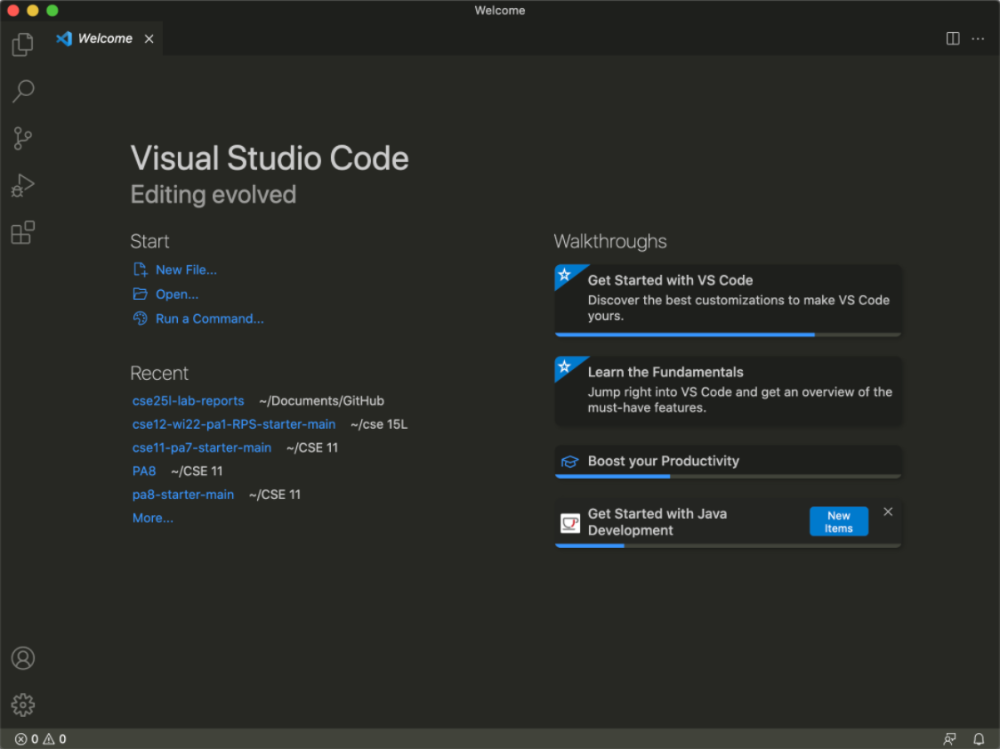
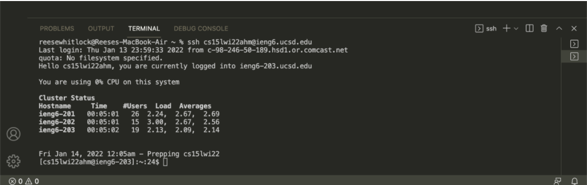
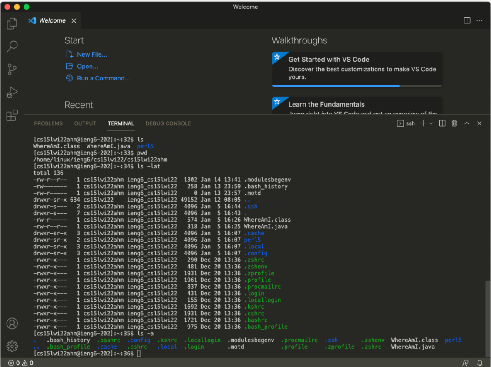
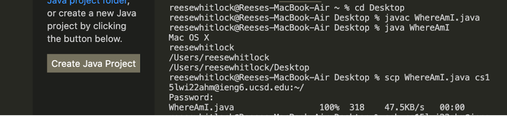
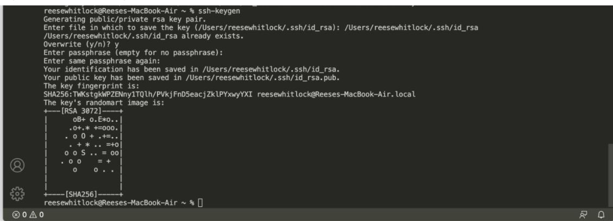
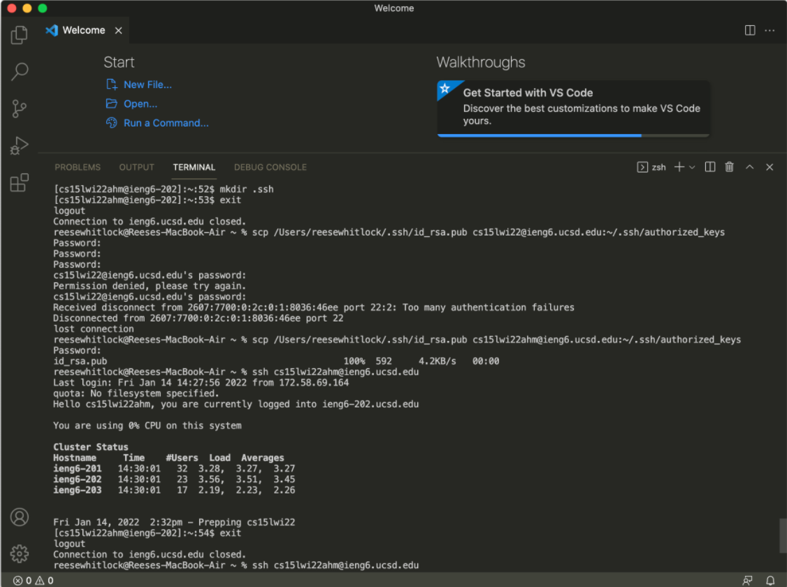
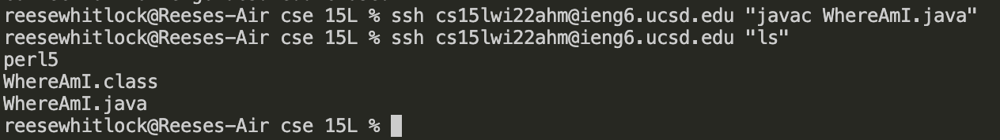

# Tutorial on how to log into a course-specific account on ieng6
## 1. Install VScode according to your operating system.

Follow this [link](https://code.visualstudio.com/download) to download VScode.

When it is up and running, it should look something like this:

## 2. Log into your account.
 Opening a terminal and type “ssh” then the name of your account. You will then be prompted to enter a password. 

`$ ssh cse15lwi22abc@ieng6.ucsd.edu`

 Once you are in the system, it should look something like this:

## 3. Try running some commands while logged into the server.
* `ls` lists the contents of the directory. Currently, the things in this directory are per15, WhereAmI.class, and WhereAmI.java.
* `pwd` prints the working directory. My current directory is /home/linux/ieng6/cs15lwi22/cs15lwi22ahm
* `ls -lat` prints the files in the directory and info about them, including the time they were accessed and the file size.
* `ls -a` prints the files that were added. I added WhereAmI.java to the directory.

## 4. `scp` command

The command scp copies files from the client computer to a remote server.

`scp fileName accountName`

As pictured below, I copied my file WhereAmI.java to the server using scp.

## 5. Creating an SSH key

We can create SSH keys so that we don’t have to enter a password every time we log into a server or copy files to a server using scp. 

The ssh command uses two files, the public key and private key, to log you in instead of you typing your password. 

The public key is stored on the server, while the private key is stored on the client.

On your client computer use the command:

>$ ssh-keygen

When asked if you want to enter a passphrase, just hit Enter so that there will be no passphrase.

In this photo, I already had a SSH key, so I was asked if I wanted to overwrite it:

When on the server, use the command in order to make a new directory called ".ssh":

`mkdir .ssh`

Then, back on the client, copy the file over using `scp`

For example, I typed:

`scp /Users/reesewhitlock/.ssh/id_rsa.pub cs15lwi22ahm@ieng6.ucsd.edu:~/.ssh/authorized_keys`

This saved the public key to a folder in .ssh called authorized_keys. You can then see me log into the server without having to enter my password.

## 6. Tips on how to optimize remote running

* Put quotation marks around a command after using an ssh command to run it on the remote server and then subsequently log out

`ssh cs15lwi22ahm@ieng6.ucsd.edu "yourCommand"`

An example:

* Run multiple commands using semicolons

`javac WhereAmI.java; java WhereAmI`
