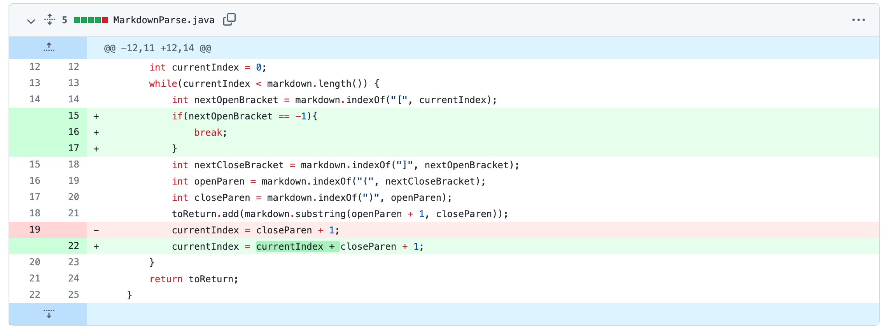
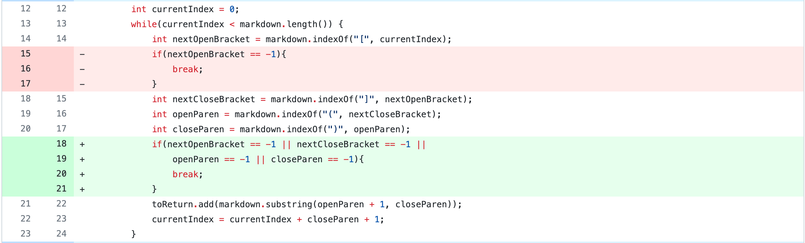
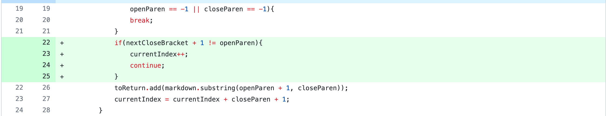

# Week 4 Lab Report
I will be showing 3 bugs and what I did to fix each one.

## Bug 1

**My fix:**


This is a [link](https://reesewhitlock.github.io/markdown-parse/myFile) to the file that caused the bug.

**Terminal output (Symptom)**

```
Exception in thread "main" java.lang.OutOfMemoryError: Java heap space
        at java.base/java.util.Arrays.copyOf(Arrays.java:3721)
        at java.base/java.util.Arrays.copyOf(Arrays.java:3690)
        at java.base/java.util.ArrayList.grow(ArrayList.java:235)
        at java.base/java.util.ArrayList.grow(ArrayList.java:242)
        at java.base/java.util.ArrayList.add(ArrayList.java:452)
        at java.base/java.util.ArrayList.add(ArrayList.java:465)
        at MarkdownParse.getLinks(MarkdownParse.java:18)
        at MarkdownParse.main(MarkdownParse.java:26)
```

The symptom of the bug was that there was an exception and java ran out of memory. This is because the bug was an infinite loop was caused when there was text in the file. There was no way to get out of the while loop if there was no closeParen to increase the currentIndex.

---

## Bug 2

**My fix:**


[Link](https://reesewhitlock.github.io/markdown-parse/myFile2) to the file that caused this bug.

**Terminal output (Symptom)**

```
Exception in thread "main" java.lang.StringIndexOutOfBoundsException: begin 8, end -1, length 22
        at java.base/java.lang.String.checkBoundsBeginEnd(String.java:3720)
        at java.base/java.lang.String.substring(String.java:1909)
        at MarkdownParse.getLinks(MarkdownParse.java:21)
        at MarkdownParse.main(MarkdownParse.java:29)
```

Similar to the last bug, the issue that caused this output was there being an absence of one of the things the program was looking for, in this case a closed parenthese. This caused an IndexOutOfBoundsException because it was looking for a variable before index of -1. I fixed this by breaking the while loop when the index of any of the items it is looking for equals -1.

---

## Bug 3

**My fix:**


[Link](https://reesewhitlock.github.io/markdown-parse/myFile3) to the file that caused this bug.

**Terminal output (Symptom)**
```
[mylink!, notALink]
```
Expected output: `[mylink!]`

The symptom was that the program was printing something that was not a link. The input that caused this failure included a link that had a space between the closed bracket and the open parenthese. The bug was that the program was not checking if the last closed bracket was right next to the next open parenthese.