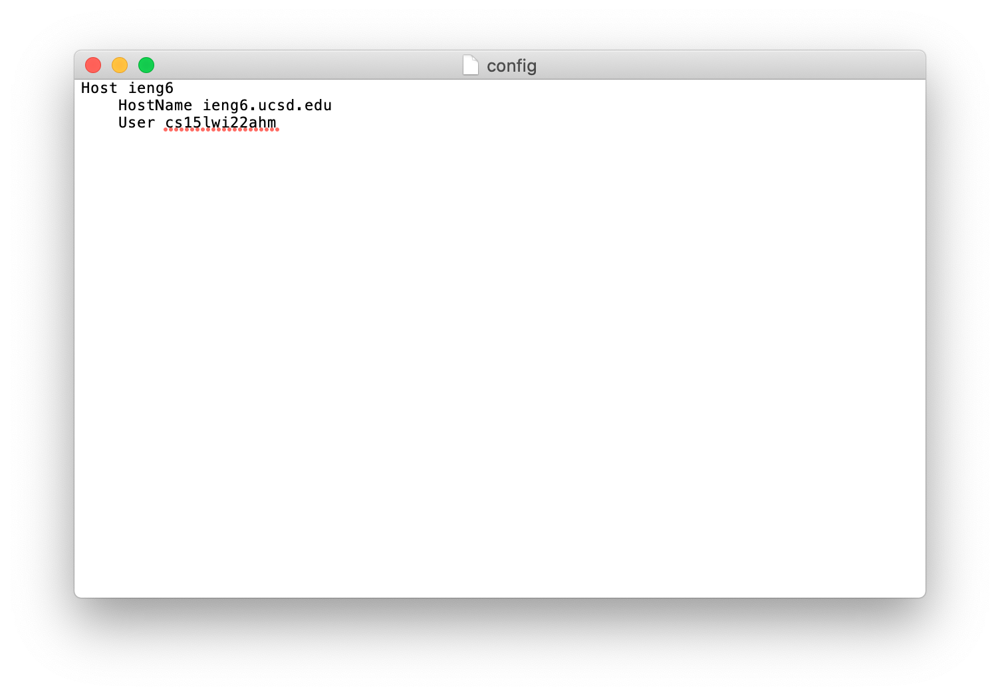
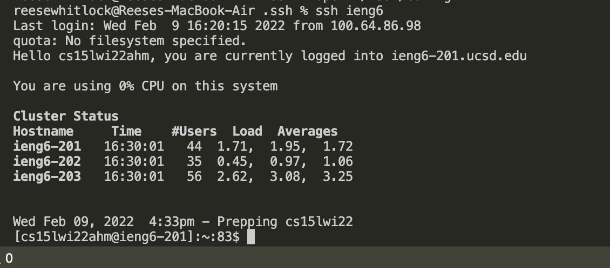
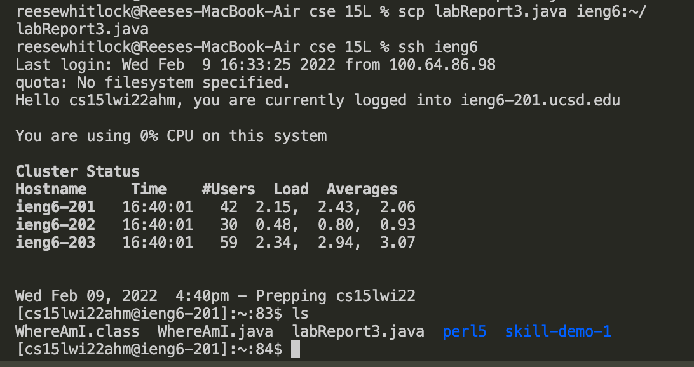

# Week 6 Lab Report
In this lab, I have chosen a task from the week 5 lab to document.

## Streamlining ssh Configuration

---

I created this file in VSCode by creating the file .ssh/config. I used the lines:

```
cd .ssh
touch config
open ~/.ssh/config
```
I was then able to edit the file, pictured here: 


---

After creating this file, I was able to log into my ieng6 account by only using the command `ssh ieng6`



---


This is me copying a file to the remote server using the alias `ieng6`



As you can see, the file shows up in the remote server.