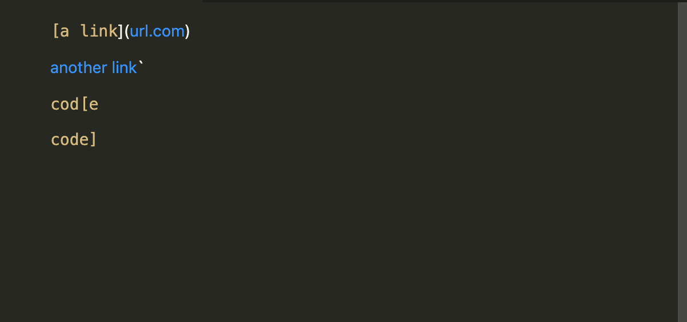
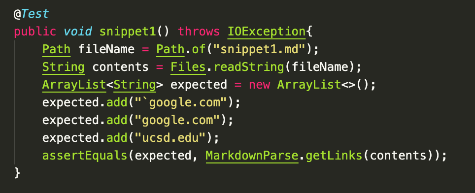
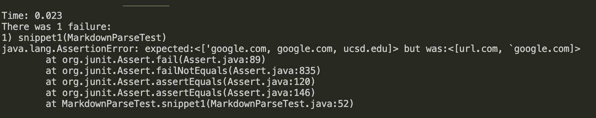

# Week 8 Lab Report
In this lab, I will review snippets and see if my markdown-parse will give the correct output. I will then compare my code to the course staff's implementation.
---
[Link to my markdown-parse repository](https://github.com/reesewhitlock/markdown-parse)

[Staff implementation](https://github.com/ucsd-cse15l-w22/markdown-parse)

## Snippet 1
---
```
`[a link`](url.com)

[another link](`google.com)`

[`cod[e`](google.com)

[`code]`](ucsd.edu)
```

How it should show up in markdown parse:


From this, I decided that the MarkdownParse.getLinks function should return: [`google.com, google.com, ucsd.edu]

Here is my test:


When testing my MarkdownParse.java, the test fails:
