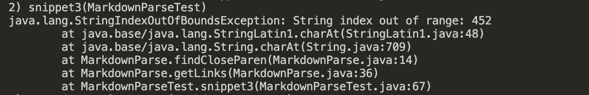

# Week 8 Lab Report
In this lab, I will review snippets and see if my markdown-parse will give the correct output. I will then compare my code to the course staff's implementation.

---
[Link to my markdown-parse repository](https://github.com/reesewhitlock/markdown-parse)

[Staff implementation](https://github.com/ucsd-cse15l-w22/markdown-parse)

## Snippet 1
---
```
`[a link`](url.com)

[another link](`google.com)`

[`cod[e`](google.com)

[`code]`](ucsd.edu)
```

How it should show up in markdown parse:


From this, I decided that the MarkdownParse.getLinks function should return: [`google.com, google.com, ucsd.edu]

Here is my test:


---

When testing my MarkdownParse.java, the test fails:


When testing the other version, the test also fails:


---
I don't think that this can be fixed within 10 lines of code, because not only do I have to check pairs of backticks, but I also have to disregard that pair if they are separated by a line ("\n") or if one of them is inside the link.

---
## Snippet 2
---
```
[a [nested link](a.com)](b.com)

[a nested parenthesized url](a.com(()))

[some escaped \[ brackets \]](example.com)
```
How it should show up in markdown parse:


From this, I decided that the MarkdownParse.getLinks function should return: [a.com, a.com(()), example.com]

Here is my test:


---

When testing my MarkdownParse.java, the test fails:


When testing the other version, the test passes.

---
I think that this can be fixed within 10 lines of code, because the other MarkdownParse returned the correct output. I think that what I would do is to check whether a line ("\n") was found right after the closed parenthese, and that would give me the correct link when there are parentheses in the link.

---
## Snippet 3
---
```
[this title text is really long and takes up more than 
one line

and has some line breaks](
    https://www.twitter.com
)

[this title text is really long and takes up more than 
one line](
    https://ucsd-cse15l-w22.github.io/
)


[this link doesn't have a closing parenthesis](github.com

And there's still some more text after that.

[this link doesn't have a closing parenthesis for a while](https://cse.ucsd.edu/


)

And then there's more text
```
How it should show up in markdown parse:


From this, I decided that the MarkdownParse.getLinks function should return: [https://ucsd-cse15l-w22.github.io/]

Here is my test:


---

When testing my MarkdownParse.java, the test fails:


When testing the other version, the test also fails:


---
I think that this can be fixed within 10 lines of code, because I would check if there is a line break within the closed brackets, and not print that link, and then trim the substring of a link so that there are no spaces before or after the link.