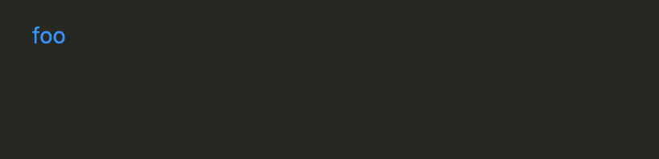

# Week 10 Lab Report
In this lab, I will compare two different implementations of markdown-parse by
choosing two test files and looking at the different output that the implementations have.

---

I found the tests with different results by using diff on two different text files that each contained the output of their implementation for the tests.

## Test 1
When I ran diff to see the differences between the results files, here is one difference between the two and the differing output:

Here is the file for the first inconsistency:

Here is the markdown parse preview:

This shows that /url is a link.