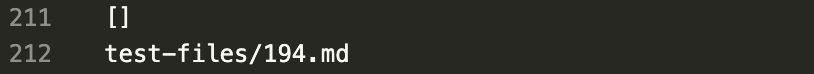
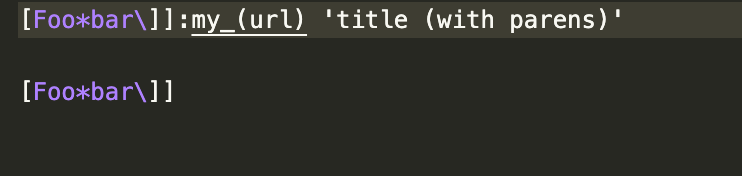

# Week 10 Lab Report
In this lab, I will compare two different implementations of markdown-parse by
choosing two test files and looking at the different output that the implementations have.

---

I found the tests with different results by using diff on two different text files that each contained the output of their implementation for the tests.

## Test 1
When I ran diff to see the differences between the results files, here is one difference between the two and the differing output:

Output for provided implementation:

Output for my implementation:

Here is the file for the first inconsistency:

The expected output is [] because there are no links in this file. Therefore, my implementation has the correct output.

---

When looking through what is wrong with the implementation, it appears to me that this block of code: should stop any links from being added because there are no open or closed parentheses:

