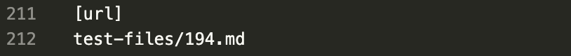

# Week 10 Lab Report
In this lab, I will compare two different implementations of markdown-parse by
choosing two test files and looking at the different output that the implementations have.

---

I found the tests with different results by using diff on two different text files that each contained the output of their implementation for the tests.

## Test 1
When I ran diff to see the differences between the results files, here is one difference between the two and the differing output:

Output for provided implementation:

Output for my implementation:

Here is the file for the first inconsistency:

The expected output is [] because there are no links in this file. Therefore, my implementation has the correct output.

---

When looking through what is wrong with the implementation, my solution is to add code that checks for characters in between the ending closed bracket and the open parenthese, because there shouldn't be any.

## Test 2
When I ran diff to see the differences between the results files, here is another difference between the two and the differing output:

Output for provided implementation:

Output for my implementation:

Here is the file for the second inconsistency:

The expected output is [foo(and(bar))]. Therefore, the provided implementation has the correct output.

---

When looking through what is wrong with my implementation, I found that I wasn't matching up open and closed parentheses like the provided implementation. Therefore, if I added a helper method like they have: 

I would be able to print the entire link without disregarding the closed parentheses.